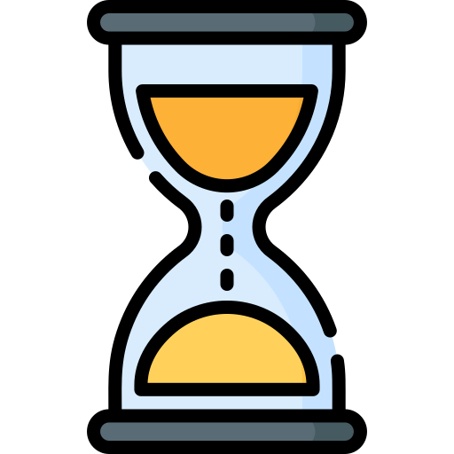

<!-- PROJECT SHIELDS -->
<div style="text-align: center;">

[](https://github.com/raquel-amaral18/GroupT_Computation3/graphs/contributors)
[](https://github.com/raquel-amaral18/GroupT_Computation3/issues)
[](https://github.com/raquel-amaral18/GroupT_Computation3/blob/main/LICENSE) 

</div>
<div style="text-align:center;">
    
</div>

<!-- ABOUT THE PROJECT -->
# Rush Hour: The Race

Rush Hour: The Race is an easy-to-play fun car racing game. Your goal is to achieve the longest ride possible without colliding with incoming cars. During your drive, collect coins to increase your score or catch different power-ups to receive a temporary advantage. 

Are you ready? Buckle up, step on the gas, and see how far you can go!


<!-- TABLE OF CONTENTS -->
<details>
  <summary>Table of Contents</summary>
  <ol>
    <li>
      <a href="#Rush Hour: The Race">Rush Hour: The Race</a>
    </li>
    <li>
      <a href="#getting-started">Getting Started</a>
      <ul>
        <li><a href="#prerequisites">Prerequisites</a></li>
        <li><a href="#installation">Installation</a></li>
      </ul>
    </li>
    <li><a href="#How to Play">How to Play</a></li>
    <li><a href="#Power-Ups">Power-Ups</a></li>
    <li><a href="#Open Issues">Open Issues</a></li>
    <li><a href="#Game Designers">Game Designers</a></li>
    <li><a href="#license">License</a></li>
  </ol>
</details>


<!-- GETTING STARTED -->
## Getting Started

This is an example of how you can get a local copy of the game and run it on your computer

### Prerequisites
Before you begin, make sure you have the following:

- Python (version 3.6 or later)


### Installation

Please note that these instructions are tailored for Windows users. If you are using a different operating system, you may need to adapt the steps accordingly.

1. **Install Anaconda:**
   - Download and install Anaconda from the [Anaconda website](https://www.anaconda.com/products/distribution).

2. **Clone the Repository:**
   - Open Anaconda Prompt.
   - Navigate to the directory where you want to clone the repository using the `cd` command.
   - Run the following command to clone the repository:
     ```bash
     git clone https://github.com/raquel-amaral18/GroupT_Computation3.git
     ```

3. **Navigate to the Cloned Repository:**
   - Change to the directory of the cloned repository:
     ```bash
     cd GroupT_Computation3
     ```

4. **Create and Activate Virtual Environment:**
   - Create a new virtual environment (replace `your_environment_name` with your desired name):
     ```bash
     conda create --name your_environment_name python=3.8
     ```
   - Activate the virtual environment:
     ```bash
     conda activate your_environment_name
     ```

5. **Install Dependencies:**
   - Install Pygame:
     ```bash
     pip install pygame
     ```

6. **Run the Game:**
   - Execute the game using the following command:
     ```bash
     python main.py
     ```


<!-- USAGE EXAMPLES -->
## How to Play

#### Singleplayer mode:
- Use **arrow keys** to move your car in the desired direction.
- Other cars will be coming towards you from the opposite direction. To survive, you have to avoid colliding with them.
- Aside from cars, you might come across **coins** or **power-ups** as well. The more coins you collect, the higher your score will be. Collecting power-ups will grant you a **temporary** advantage.

#### Multiplayer mode:
In this mode, players have two exciting options to choose from:
1. **Single Road:**
   - **Player 1:** Use arrow keys to control your car. 
   - **Player 2:** Use 'WASD' keys to navigate your car.
   - Race against each other on a single highway, avoiding collisions and competing for survival.
   - Collect 10 coins and earn yourself an extra life.
   - Remember, **you can't overlap**, so strategic maneuvering is key.
   - No power-ups are available in this mode, making it a pure test of skill.

2. **Double Road:**
   - **Player 1:** Use arrow keys for your right highway.
   - **Player 2:** Use 'WASD' keys for your left highway.
   - Engage in a thrilling race where the goal is to outlast your opponent. In case one of the players crash, the other will be able to continue playing. The main goal will be to **survive longer** than the other player.
   - Two separate highways present different obstacles and opportunities for each player.
   - Each player starts with 3 lives, and the one who survives the longest emerges victorious.

  Invite a friend to play with you, and let the race begin! Will you be the ultimate champion of the roads?


<!--POWER-UPS -->
## Power-Ups

Enhance your racing experience with these exciting powerups! Collect them during the game to gain unique advantages.

1. **Invincibility:**

<div style="text-align:center;">
    
</div>

- **Effect:** Gain temporary invincibility, protecting your car from collisions.
- **Duration:** 4 seconds

<br>

2. **Slow Down:**

<div style="text-align:center;">
    
</div>

- **Effect:** Force incoming cars to slow down, making it easier to navigate through the traffic.
- **Duration:** 3 seconds

<br>

3. **Extra Lives:**

<div style="text-align:center;">
    
</div>

- **Effect:** Receive additional lives to extend your gameplay.

<br>

4. **Jet Bomb:**

<div style="text-align:center;">
    
</div>

- **Effect:** Propel your car forward at high speed, causing explosions with incoming cars when you collide.
- **Duration:** 4 seconds

<br>

5. **Shrink:**

<div style="text-align:center;">
    
</div>

- **Effect:** Decrease the size of your car, making it easier to navigate through tight spaces.
- **Duration:** 3 seconds

> **Note:** You can catch multiple power-ups simultaneously, either of the same type for extended duration or different types for combined effects.


<!--OPEN ISSUES -->
## Open Issues

These are areas where improvements or additional features could be considered. While they may not be critical for the fundamental functionality of the game, addressing these items could enhance the overall user experience and contribute to the project's growth:

- [ ] Code Optimization
- [x] Example 2
- [x] Example 3
- [ ] Example 4
- [ ] Example 5


<!-- CONTRIBUTING -->
## Game Designers
This game was created as part of the course requirements for Computation III during the October semester 2023-2024. The project represents the collaborative effort of the following contributors:

- **Guilherme Marques**
  - *Student Number:* 20221780

- **Rafael Ribeiro**
  - *Student Number:* 20221853

- **Raquel Amaral**
  - *Student Number:* 20221844


<!-- LICENSE -->
## License

Distributed under the MIT License. See `LICENSE.txt` for more information.

